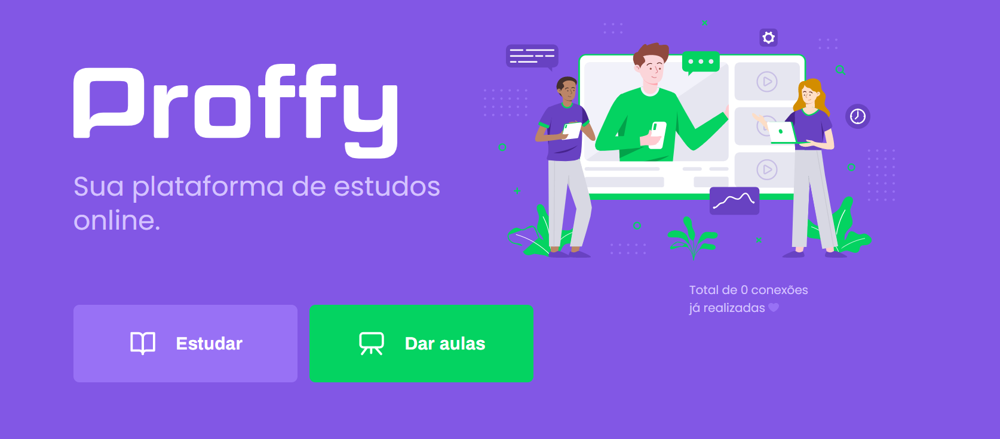

## App made with React and Typescript to connect students and teachers
 

* You can check it out [here]()  

* Made during Next Level Week #2 from [Rockseat](https://rocketseat.com.br/);  

### Home page

* Mobile version also available [here](https://github.com/cassiogroh/Proffy_mobile);  

* Backend built on Node.js and running at [Heroku](https://www.heroku.com/home)  

**Clone this repo and run `npm start` to check its features closely.**